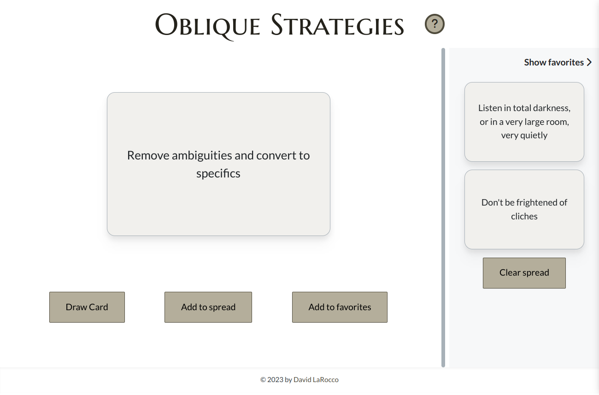

# Oblique Strategies: An application to help overcome creative blocks

## Overview
This application is based on a deck of cards created by the musician Brian Eno and artist Peter Schmidt. An individual card can be drawn randomly from the deck, providing a suggestion, phrase, or word that offers an alternative way to think about a problem.  Other features include saving multiple cards in a layout to combine multiple strategies, and being able to save favorite strategies (persistant in localStorage) to review later when needed.

If you're interested in how I built this app, check out the [project page](https://davidlarocco.dev/src/pages/project-oblique-strategies.html) on my portfolio website!
## Installation and Usage
Oblique Strategies is a React web  application, and can be loaded with a web browser (use this [link](https://harrekki-oblique-strategies.netlify.app/)).  While it is responsive, it will perform best on the desktop.  
To run locally, you will need to install [node.js](https://nodejs.org/en/download) and then clone this respository. You can then run the following commands:
```bash
cd oblique-strategies
npm install
npm run dev
``` 
You should then be able to run the app with your browser by typing in the localhost address shown.
## How To Use the Deck
There is no right or wrong way to interact with the deck, as Eno himself said in the original introduction that was included with the first three editions:
> &quot;[The cards] can be used as a pack (a set of possibilities being continuously reviewed in the mind) or by drawing a single card from the shuffled pack when a dilemma occurs in a working situation. In this case, the card is trusted even if the appropriateness is quite unclear. They are not final, as new ideas will present themselves...&quot;

Clicking the &quot;Draw card&quot; button will display a single, random strategy. If you want to arrange a layout of several strategies, click the &quot;Add to spread&quot; button and expand the frame on the right to view your spread or clear it.  You can also save strategies by clicking the &quot;Add to favorites&quot; button for easy review. 
## Additional Information
* [Wikipedia page](https://en.wikipedia.org/wiki/Oblique_Strategies)
* [Complete list of strategies](https://matt-rickard.com/list-of-all-oblique-strategies)
* [Purchase a physical deck](https://www.amazon.com/Oblique-strategies-hundred-worthwhile-dilemmas/dp/B0000EEZG9)
## Credits

Oblique Strategies &copy; 1975, 1978, and 1979 &mdash; [Brian Eno](https://www.brian-eno.net/) & [Peter Schmidt](http://www.peterschmidtweb.com/main.html)
## License
[GNU GPLv3](https://choosealicense.com/licenses/gpl-3.0/)
